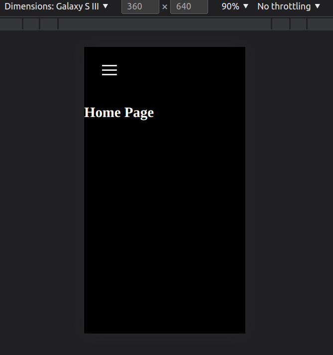
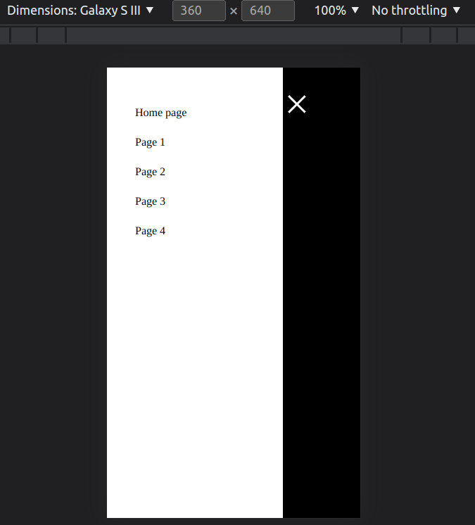

# Hamburger menu

Reusable, responsive and accesibility hamburger menu in SCSS.

Created with this tutorial:
https://youtu.be/QWn7kP-QoNw

# Accesibility

- The menu can be used by people with disabilities
- The menu is built on the button, not on divs with spans. You can use the keyboard to navigate

# What You need ?

You need only copy SCSS style and HTML structure, add @media for You site - Voilà !

- Adds preferred fonts and styles for links
- You can change colors and dimensions in variables
- You can change the animations, when the menu appears

# How look menu ?

